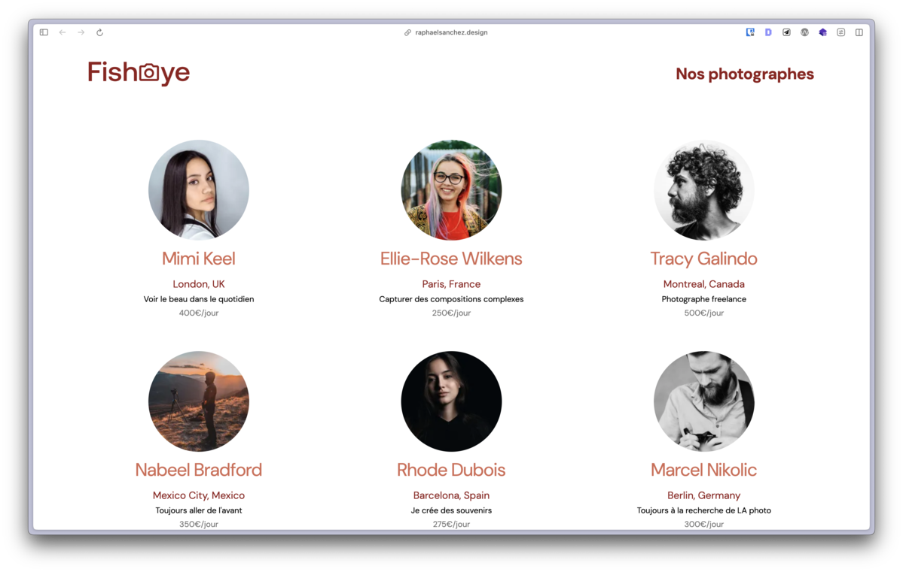

# FishEye


[Version en ligne](https://raphaelsanchez.github.io/oc-p6-fisheye/) | [Rapport AChecker](https://achecker.ca/checker/index.php?uri=https%3A%2F%2Fraphaelsanchez.github.io%2Foc-p6-fisheye%2F&gid=WCAG2-AA) | [Rapport W3C Validator](https://validator.w3.org/nu/?doc=https%3A%2F%2Fraphaelsanchez.github.io%2Foc-p6-fisheye%2F) | [Rapport Lighthouse](https://lighthouse-dot-webdotdevsite.appspot.com//lh/html?url=https%3A%2F%2Fraphaelsanchez.github.io%2Foc-p6-fisheye%2F)



## Table des matières

- [Contexte du projet](#contexte-du-projet)
- [Installation](#installation)
- [Utilisation](#utilisation)
- [Auteur](#auteur)
- [Bugs report](#bugs-report)

## Contexte du projet

Projet fictif réalisé dans le cadre du programme de formation **Développeur Front-end JavaScript React** chez [OpenClassrooms](https://openclassrooms.com) dont le but est de réaliser un site web pour une entreprise de photographes freelances.

### L'accessibilité est clé !

- Utilisez des éléments HTML "sémantiques" qui décrivent leur intention autant que possible, au lieu de mettre des éléments <div> et <span> partout.
- Lorsque vous devez créer un élément personnalisé, ajoutez des attributs ARIA pour décrire ce qu'il fait.
- Les images doivent présenter un attribut “alt”. Utilisez le titre des photos pour remplir cet attribut, et le nom du photographe dans le cas d’une photo de profil de photographe.
- Le code devrait passer les tests [AChecker](https://idrc.ocadu.ca/) sans “known issue” (afin qu'il soit conforme aux WCAG).
- Toute la gestion des événements (par exemple, les clics et les pressions au clavier) doit être configurée (utilisez KeyboardEvent.key ou KeyboardEvent.code.).
- Utilisez un [lecteur d'écran gratuit](https://developer.mozilla.org/fr/docs/Learn/Tools_and_testing/Cross_browser_testing/Accessibility) pour vous faire une idée de ce que représente l'utilisation du site pour une personne malvoyante.

### Contraintes techniques additionnelles

- Le code est séparé en différents fichiers (HTML, CSS, JavaScript).
- ESLint est utilisé (avec les paramètres par défaut) pour garantir que le code est robuste. Ceci est particulièrement facile à intégrer avec l'IDE VSCode.
- Une version moderne (ES6 ou supérieure) de JavaScript est utilisée et les fonctionnalités obsolètes ne sont pas utilisées.
- Le code est lisible. Il faudra s'assurer que les variables et fonctions ont un nom qui ont un sens, et commenter le code lorsque le nom n'indique pas explicitement ce qu'il se passe.

### Technologies utilisées

- [HTML5](https://developer.mozilla.org/fr/docs/Web/HTML)
- [JavaScript](https://developer.mozilla.org/fr/docs/Web/JavaScript)
- [pnpm](https://pnpm.io/)
- [postCSS](https://postcss.org/)
- [ESLint](https://eslint.org/)
- [Prettier](https://prettier.io/)

### Validations du code

- [W3C Validator](https://validator.w3.org/) - validation HTML
- [WAVE](https://wave.webaim.org/) - validation d'accessibilité basique
- [AChecker](https://achecker.ca/checker/index.php) - validation d'accessibilité avancée
- [Lighthouse](https://developers.google.com/web/tools/lighthouse) - audit de performance, accessibilité, bonnes pratiques et référencement
- [ESLint](https://eslint.org/) - validation du code JavaScript

## Installation

1. Cloner le dépôt

```sh
git clone https://github.com/raphaelsanchez/oc-p6-fisheye.git
```

2. Installer les dépendances

```sh
pnpm install #ou npm install
```

3. Démarrer le serveur de développement

```sh
pnpm dev
```

## Utilisation

1. Build du projet

```sh
pnpm build
```

2. optimisation des images

```sh
pnpm optimize:medias
```

3. linting du code

```sh
pnpm lint
```

## Auteur

[Raphael Sanchez](https://www.linkedin.com/in/raphael-sanchez-design/)

## Bugs report

Si vous trouvez un bug, vous pouvez [ouvrir une issue](https://github.com/raphaelsanchez/oc-p6-fisheye/issues).

> NB : Étant un projet de formation aucune garantie qu'il sera corrigé mais on apprend toujours beaucoup de ces erreurs 😊.
